# Python: Día 1 - Introducción

## Introducción

Python es un lenguaje de programación de alto nivel para programación de propósito general. Es un lenguaje de programación orientado a objetos, interpretado y de código abierto. Python fue creado por un programador holandés, Guido van Rossum. El nombre del lenguaje de programación Python se deriva de una serie de comedia de sketches británica, *Monty Python's Flying Circus*. La primera versión se lanzó el 20 de febrero de 1991. Este desafío  de Python te ayudará a aprender la última versión de Python, Python 3, paso a paso. Los temas se dividen en 30 clases, donde cada día contiene varios temas con explicaciones fáciles de entender, ejemplos del mundo real y muchos ejercicios y proyectos prácticos.

## ¿Por qué Python?

Es un lenguaje de programación muy parecido al lenguaje humano y, por eso, es fácil de aprender y usar.
Python es utilizado por varias industrias y empresas (incluido Google). Se ha utilizado para desarrollar aplicaciones web, aplicaciones de escritorio, administración de sistemas y bibliotecas de aprendizaje automático. Python es un lenguaje muy aceptado en la comunidad de ciencia de datos y aprendizaje automático. Espero que esto sea suficiente para convencerte de comenzar a aprender Python. Python se está comiendo al mundo y tú lo estás matando antes de que te coma a ti.

## Environment Setup

### Installing Python

To run a python script you need to install python. Let's [download](https://www.python.org/) python.
If your are a windows user. Click the button encircled in red.

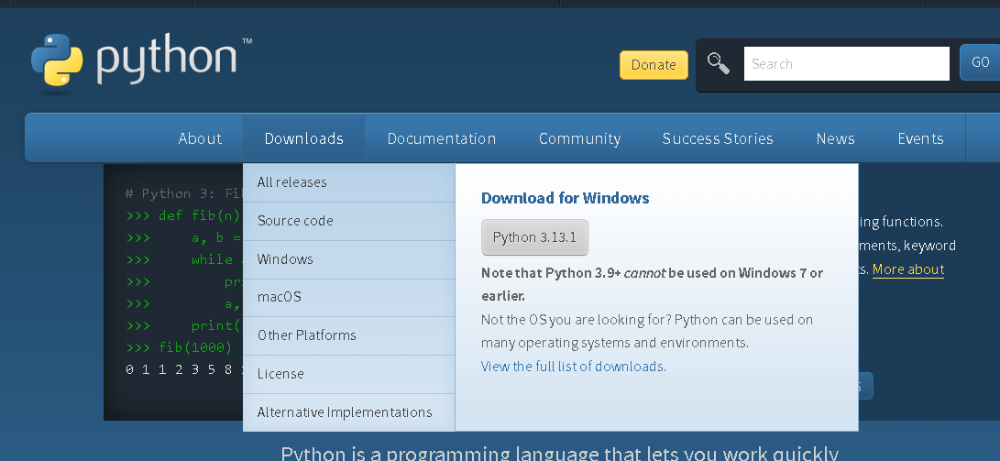

Para comprobar si Python está instalado, escriba el siguiente comando en la terminal de su dispositivo.

```python
python --version
```

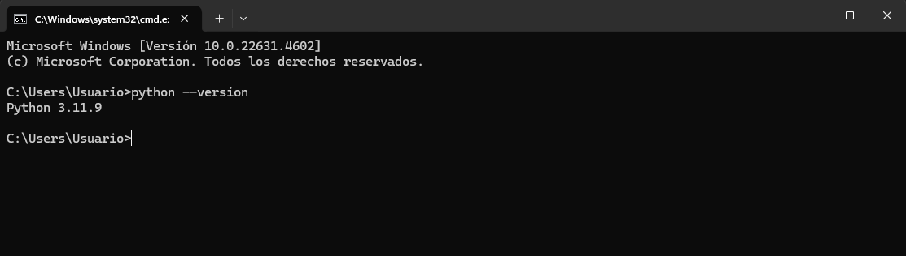

### Python Shell

Python es un lenguaje de programación interpretado, por lo que no necesita compilarse. Esto significa que ejecuta el código línea por línea. Python viene con un *Python Shell (Python Interactive Shell)*. Se utiliza para ejecutar un solo comando de Python y obtener el resultado.

Python Shell espera el código Python del usuario. Cuando ingresa el código, lo interpreta y muestra el resultado en la siguiente línea.
Abra su terminal o símbolo del sistema (cmd) y escriba:

```python
python
```

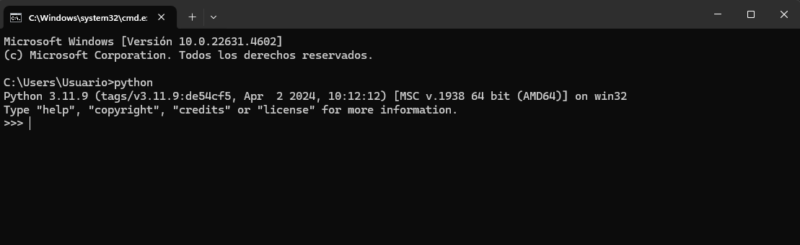

Se abre el shell interactivo de Python y está esperando que escribas el código de Python (script de Python). Escribirás tu script de Python junto a este símbolo >>> y luego harás clic en Enter.
Escribamos nuestro primer script en el shell de scripts de Python.

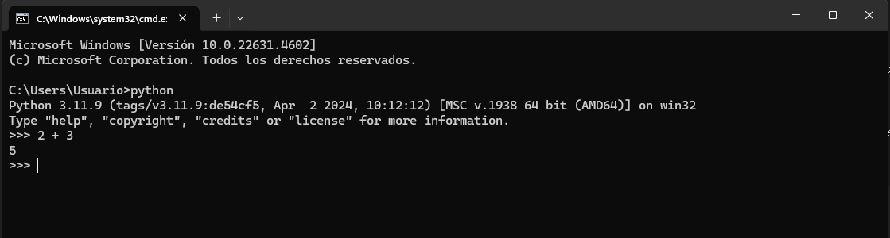

Bien hecho, escribiste tu primer script de Python en el shell interactivo de Python. ¿Cómo cerramos el shell interactivo de Python?
Para cerrar el shell, junto a este símbolo >> escribe el comando **exit()** y presiona Enter.

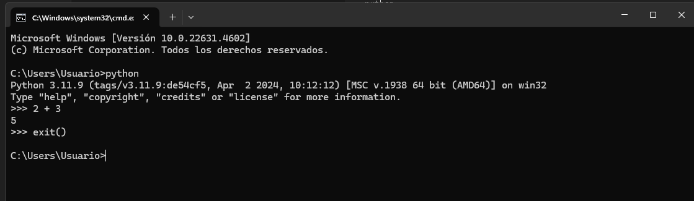

Ahora ya sabes cómo abrir el shell interactivo de Python y cómo salir de él.

Python te dará resultados si escribes scripts que Python entienda; si no, devolverá errores. Cometamos un error deliberado y veamos qué devolverá Python.

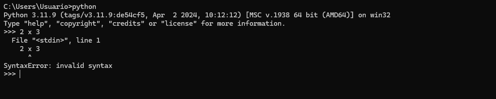

Como puede ver en el error devuelto, Python es tan inteligente que sabe cuál fue el error que cometimos y que fue *Error de sintaxis: sintaxis no válida*. Usar x como multiplicación en Python es un error de sintaxis porque (x) no es una sintaxis válida en Python. En lugar de (**x**) usamos un asterisco (\*) para la multiplicación. El error devuelto muestra claramente qué se debe corregir.

El proceso de identificar y eliminar errores de un programa se llama *depuración*. Depurémoslo colocando * en lugar de **x**.

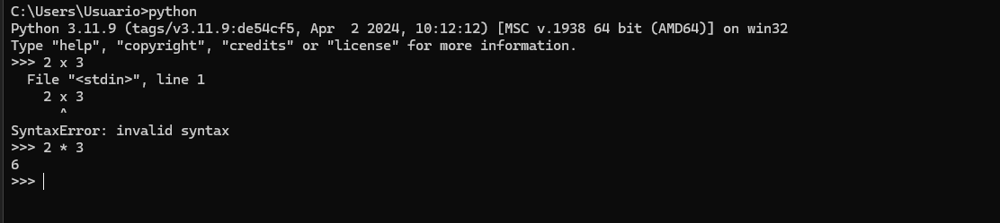

Nuestro error fue corregido, el código se ejecutó y obtuvimos el resultado que esperábamos. Como programador, verás este tipo de errores a diario. Es bueno saber cómo depurar. Para ser bueno en la depuración, debes comprender qué tipo de errores enfrentas. Algunos de los errores de Python que puedes encontrar son *SyntaxError*, *IndexError*, *NameError*, *ModuleNotFoundError*, *KeyError*, *ImportError*, *AttributeError*, *TypeError*, *ValueError*, *ZeroDivisionError*, etc. Veremos más sobre los diferentes ***tipos de errores*** de Python en secciones posteriores.

Practiquemos más cómo usar el shell interactivo de Python. Ve a tu terminal o símbolo del sistema y escribe la palabra **python**.

Se abre el shell interactivo de Python. Hagamos algunas operaciones matemáticas básicas (suma, resta, multiplicación, división, módulo, exponencial).

Hagamos algunos cálculos antes de escribir cualquier código Python:

- 2 + 3 es 5
- 3 - 2 es 1
- 3 \* 2 es 6
- 3 / 2 es 1,5
- 3 ** 2 es lo mismo que 3 * 3

En Python tenemos las siguientes operaciones adicionales:

- 3 % 2 = 1 => que significa encontrar el resto
- 3 // 2 = 1 => que significa eliminar el resto

Cambiemos las expresiones matemáticas anteriores a código Python. Se ha abierto el shell Python y podemos escribir un comentario al principio del shell.

Un *comentario* es una parte del código que Python no ejecuta. Por lo tanto, podemos dejar algo de texto en nuestro código para que sea más legible. Python no ejecuta la parte del comentario. Un comentario en Python comienza con el símbolo numeral (#).
Así es como se escribe un comentario en Python

```python
 # comment starts with hash
 # this is a python comment, because it starts with a (#) symbol
```

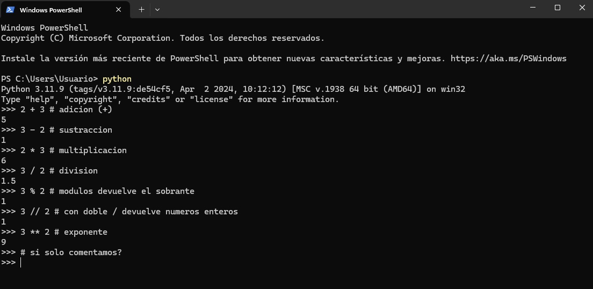

Antes de pasar a la siguiente sección, practiquemos más en el shell interactivo de Python. Cierre el shell abierto escribiendo *exit()* en el shell y ábralo nuevamente y practiquemos cómo escribir texto en el shell de Python.

## Python básico

### Sintaxis de Python

Un script de Python se puede escribir en el shell interactivo de Python o en el editor de código. Un archivo de Python tiene una extensión .py.

### Sangría de Python

Una sangría es un espacio en blanco en un texto. La sangría en muchos lenguajes se utiliza para aumentar la legibilidad del código; sin embargo, Python utiliza la sangría para crear bloques de código. En otros lenguajes de programación, se utilizan llaves para crear bloques de código en lugar de sangría. Uno de los errores comunes al escribir código Python es la sangría incorrecta.

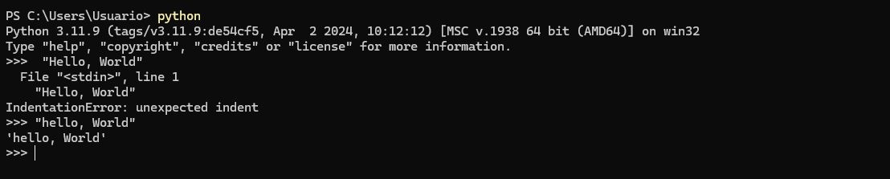

### Comentarios

Los comentarios juegan un papel crucial en la mejora de la legibilidad del código y permiten a los desarrolladores dejar notas dentro de su código. En Python, cualquier texto precedido por un símbolo de almohadilla (#) se considera un comentario y no se ejecuta cuando se ejecuta el código.

**Ejemplo: comentario de una sola línea**

```
# Este es el primer comentario
# Este es el segundo comentario
# Python se está comiendo el mundo

```

**Ejemplo: comentario de varias líneas**

Se pueden usar comillas triples para comentarios de varias líneas si no están asignados a una variable

```
"""Este es un comentario de varias líneas
Un comentario de varias líneas ocupa varias líneas.
Python se está comiendo el mundo
"""

```

### Tipos de datos

En Python hay varios tipos de datos. Empecemos con los más comunes. Los diferentes tipos de datos se tratarán en detalle en otras secciones. Por el momento, repasemos los diferentes tipos de datos y familiaricémonos con ellos. No es necesario que los comprendas bien ahora.

### Number

- Entero: números enteros (negativos, cero y positivos)
Ejemplo:
... -3, -2, -1, 0, 1, 2, 3 ...
- Flotante: número decimal
Ejemplo
... -3,5, -2,25, -1,0, 0,0, 1,1, 2,2, 3,5 ...
- Complejo
Ejemplo
1 + j, 2 + 4j

### String

Una colección de uno o más caracteres bajo comillas simples o dobles. Si una cadena es más de una oración, usamos comillas triples.

**Ejemplo:**

```
'Asabeneh'
'Finlandia'
'Python'
'Me encanta enseñar'
'Espero que estés disfrutando el primer día del desafío ClasesdePython'

```

### Booleanos

Un tipo de datos booleano es un valor verdadero o falso. T y F siempre deben estar en mayúsculas.

**Ejemplo:**

```python
True # ¿Está encendida la luz? Si está encendida, entonces el valor es True
False # ¿Está encendida la luz? Si está apagada, entonces el valor es False

```

### Lista

La lista de Python es una colección ordenada que permite almacenar elementos de diferentes tipos de datos. Una lista es similar a una matriz en JavaScript.

**Ejemplo:**

```
[0, 1, 2, 3, 4, 5] # todos son del mismo tipo de datos: una lista de números
['Banana', 'Orange', 'Mango', 'Avocado'] # todos son del mismo tipo de datos: una lista de cadenas (frutas)
['Finland','Estonia', 'Sweden','Norway'] # todos son del mismo tipo de datos: una lista de cadenas (países)
['Banana', 10, False, 9.81] # diferentes tipos de datos en la lista: cadena, entero, booleano y flotante

```

### Diccionario

Un objeto de diccionario de Python es una colección desordenada de datos en un formato de par clave-valor.

**Ejemplo:**

```
{
'first_name':'Nelson',
'last_name':'Diaz',
'country':'Finland',
'age':250,
'is_married':True,
'skills':['JS', 'React', 'Node', 'Python']
}
```

### Tupla

Una tupla es una colección ordenada de diferentes tipos de datos, como una lista, pero las tuplas no se pueden modificar una vez que se crean. Son inmutables.

**Ejemplo:**

```
('Asabeneh', 'Pawel', 'Brook', 'Abraham', 'Lidiya') # Nombres

```

```
('Tierra', 'Júpiter', 'Neptuno', 'Marte', 'Venus', 'Saturno', 'Urano', 'Mercurio') # planetas

```

### Set

Un conjunto es una colección de tipos de datos similar a una lista y una tupla. A diferencia de una lista y una tupla, un conjunto no es una colección ordenada de elementos. Al igual que en Matemáticas, un conjunto en Python almacena solo elementos únicos.

En secciones posteriores, analizaremos en detalle todos y cada uno de los tipos de datos de Python.

**Ejemplo:**

```
{2, 4, 3, 5}
{3.14, 9.81, 2.7} # el orden no es importante en un conjunto

```

### Comprobación de tipos de datos

Para comprobar el tipo de datos de determinados datos o variables, utilizamos la función **type**. En la siguiente terminal verás diferentes tipos de datos de Python:

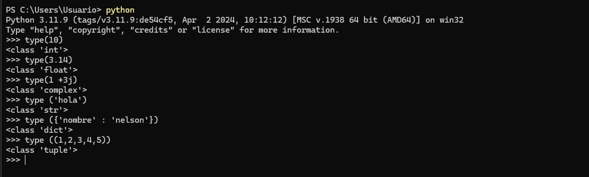

### Archivo Python

Primero abre la carpeta de tu proyecto. Si no tienes esta carpeta, crea una carpeta llamada practicaPython. Dentro de esta carpeta, crea un archivo llamado [helloworld.py](http://helloworld.py/). Ahora, hagamos lo que hicimos en el shell interactivo de Python usando Visual Studio Code.

El shell interactivo de Python imprimía sin usar **print**, pero en Visual Studio Code para ver nuestro resultado deberíamos usar una función incorporada _print(). La función incorporada *print()* toma uno o más argumentos de la siguiente manera *print('arument1', 'argument2', 'argument3')*. Mira los ejemplos a continuación.

**Ejemplo:**

El nombre del archivo es [helloworld.py](http://helloworld.py/)

```
# Día 1 - Desafío ClasesdePython

print(2 + 3) # suma(+)
print(3 - 1) # resta(-)
print(2 * 3) # multiplicación(*)
print(3 / 2) # división(/)
print(3 ** 2) # exponencial(**)
print(3 % 2) # módulo(%)
print(3 // 2) # Operador de división de piso(//)

# Verificación de tipos de datos
print(type(10)) # Int
print(type(3.14)) # Float
print(type(1 + 3j)) # Número complejo
print(type('Asabeneh')) # Cadena
print(type([1, 2, 3])) # Lista
print(type({'name':'Asabeneh'})) # Diccionario
print(type({9.8, 3.14, 2.7})) # Set
print(type((9.8, 3.14, 2.7))) # Tuple

```

Para ejecutar el archivo de Python, consulte la imagen a continuación. Puede ejecutar el archivo de Python ya sea ejecutando el botón verde en Visual Studio Code o escribiendo *python [helloworld.py](http://helloworld.py/)* en la terminal.

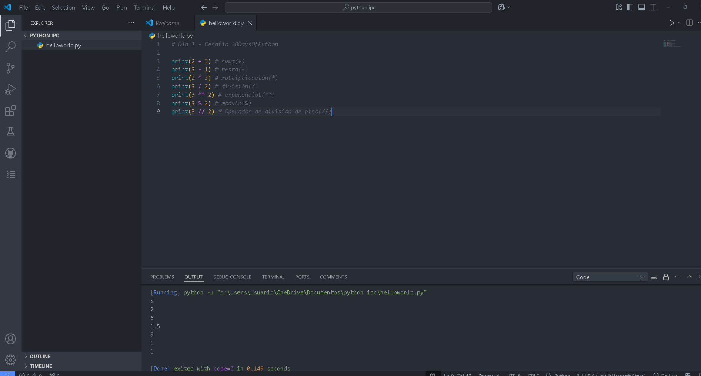

## 💻 Ejercicios - Día 1

### Ejercicio: Nivel 1

- Comprueba la versión de Python que estás usando
- Abre la consola interactiva de Python y realiza las siguientes operaciones. Los operandos son 3 y 4.
    - suma(+)
    - resta(-)
    - multiplicación(\*)
    - módulo(%)
    - división(/)
    - exponencial(\*\*)
    - operador de división de base(//)
- Escribe cadenas en la consola interactiva de Python. Las cadenas son las siguientes:
    - Tu nombre
    - Tu apellido
    - Tu país
    - Estoy disfrutando de clases de Python
- Comprueba los tipos de datos de los siguientes datos:
    - 10
    - 9.8
    - 3.14
    - 4 - 4j
    - ['Nelson', 'Python', 'Panama']
    - ​​Tu nombre
    - Tu apellido
    - Tu país

### Ejercicio: Nivel 2

- Crea una carpeta llamada day_1 dentro de la carpeta ClasesdePython. Dentro de la carpeta day_1, crea un archivo de Python helloworld.py y repite las preguntas 1, 2, 3 y 4. Recuerda usar *print()* cuando estés trabajando en un archivo de Python. Navega hasta el directorio donde hayas guardado el archivo y ejecútalo.

### Ejercicio: Nivel 3

- Escribe un ejemplo para diferentes tipos de datos de Python, como Número (Entero, Flotante, Complejo), Cadena, Booleano, Lista, Tupla, Conjunto y Diccionario.
- Encuentra una distancia [euclidiana](https://es.wikipedia.org/wiki/Distancia_euclidiana) entre (2, 3) y (10, 8)
    
    

🎉 ¡FELICITACIONES! 🎉
