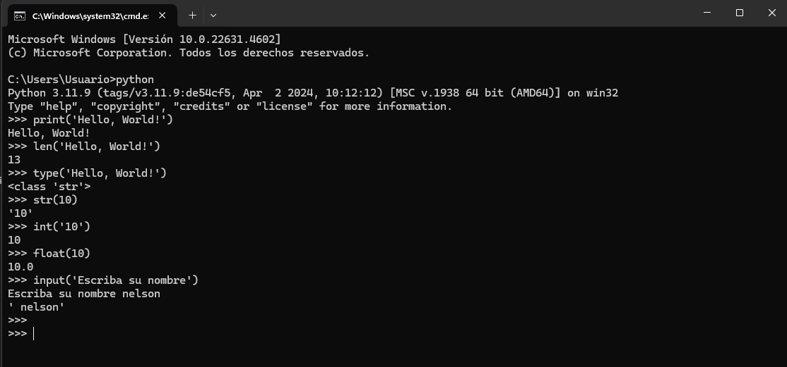
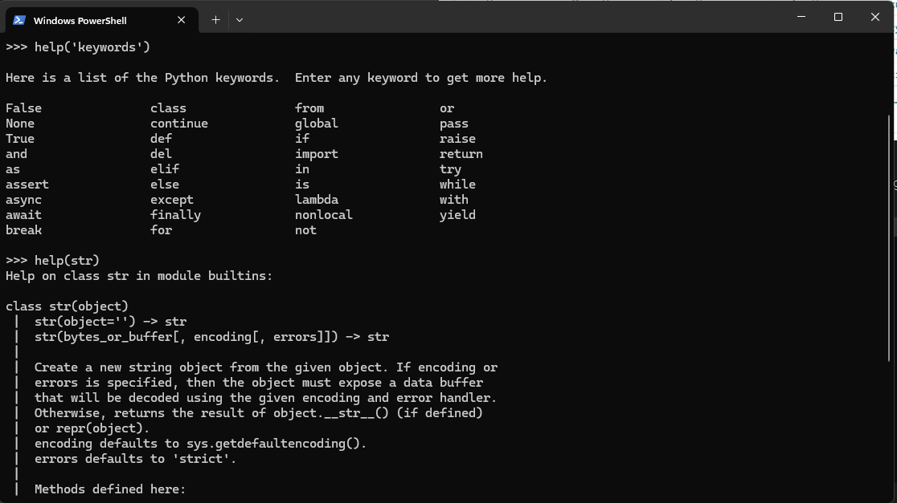
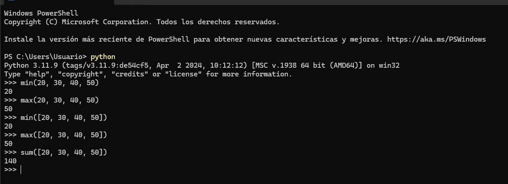

# Python: Dia 2 - Variables y funciones incorporadas

## Funciones integradas

En Python tenemos muchas funciones integradas. Las funciones integradas están disponibles globalmente para su uso, lo que significa que puede utilizarlas sin importarlas ni configurarlas. Algunas de las funciones integradas de Python más utilizadas son las siguientes: *print()*, *len()*, *type()*, *int()*, *float()*, *str()*, *input()*, *list()*, *dict()*, *min()*, *max()*, *sum()*, *sorted()*, *open()*, *file()*, *help()* y *dir()*. En la siguiente tabla, verá una lista exhaustiva de las funciones integradas de Python extraídas de la [documentación de Python](https://docs.python.org/3.9/library/functions.html).


Abramos el shell de Python y comencemos a utilizar algunas de las funciones integradas más comunes.



Practiquemos más utilizando diferentes funciones integradas.



Como puede ver en la terminal anterior, Python tiene palabras reservadas. No usamos palabras reservadas para declarar variables o funciones. Trataremos las variables en la siguiente sección.

Creo que a esta altura ya está familiarizado con las funciones integradas. Hagamos una práctica más de funciones integradas y pasaremos a la siguiente sección.



## Variables

Las variables almacenan datos en la memoria de una computadora. Se recomienda el uso de variables mnemotécnicas en muchos lenguajes de programación. Una variable mnemotécnica es un nombre de variable que se puede recordar y asociar fácilmente. Una variable se refiere a una dirección de memoria en la que se almacenan datos.
No se permiten números al principio, caracteres especiales ni guiones al nombrar una variable. Una variable puede tener un nombre corto (como x, y, z), pero se recomienda encarecidamente un nombre más descriptivo (nombre, apellido, edad, país).

Reglas de nombres de variables de Python

- Un nombre de variable debe comenzar con una letra o el carácter de guión bajo
- Un nombre de variable no puede comenzar con un número
- Un nombre de variable solo puede contener caracteres alfanuméricos y guiones bajos (A-z, 0-9 y \_)
- Los nombres de variable distinguen entre mayúsculas y minúsculas (firstname, Firstname, FirstName y FIRSTNAME) son variables diferentes)

A continuación, se muestran algunos ejemplos de nombres de variables válidos:

```python
firstname
lastname
age
country
city
first_name
last_name
capital_city
_if # if we want to use reserved word as a variable
year_2021
year2021
current_year_2021
birth_year
num1
num2
```

Nombres de variables no válidos

```python
first-name
first@name
first$name
num-1
1num
```

Usaremos el estilo estándar de nombres de variables de Python que ha sido adoptado por muchos desarrolladores de Python. Los desarrolladores de Python usan la convención de nombres de variables snake_case (snake_case). Usamos el carácter de guión bajo después de cada palabra para una variable que contiene más de una palabra (por ejemplo, first_name, last_name, engine_rotation_speed). El ejemplo a continuación es un ejemplo de nombres estándar de variables, el guión bajo es necesario cuando el nombre de la variable tiene más de una palabra.

Cuando asignamos un cierto tipo de datos a una variable, se llama declaración de variable. Por ejemplo, en el ejemplo a continuación, mi nombre está asignado a una variable first_name. El signo igual es un operador de asignación. Asignar significa almacenar datos en la variable. El signo igual en Python no es igualdad como en Matemáticas.

*Ejemplo:*

```python
# Variables in Python
first_name = 'Nelson'
last_name = 'Diaz'
country = 'España'
city = 'Caceres'
age = 250
is_married = True
skills = ['HTML', 'CSS', 'JS', 'React', 'Python']
person_info = {
   'firstname':'Nelson',
   'lastname':'Diaz',
   'country':'España',
   'city':'Caceres'
   }
```

Utilicemos las funciones integradas *print()* y *len()*. La función Print acepta una cantidad ilimitada de argumentos. Un argumento es un valor que se puede pasar o colocar dentro de los paréntesis de la función, vea el ejemplo a continuación.

**Ejemplo:**

```python
print('Hello, World!') # The text Hello, World! is an argument
print('Hello',',', 'World','!') # it can take multiple arguments, four arguments have been passed
print(len('Hello, World!')) # it takes only one argument
```

Imprimamos y busquemos también la longitud de las variables declaradas en la parte superior:

**Ejemplo:**

```python
# Printing the values stored in the variables

print('First name:', first_name)
print('First name length:', len(first_name))
print('Last name: ', last_name)
print('Last name length: ', len(last_name))
print('Country: ', country)
print('City: ', city)
print('Age: ', age)
print('Married: ', is_married)
print('Skills: ', skills)
print('Person information: ', person_info)
```

### Declaración de múltiples variables en una línea

También se pueden declarar múltiples variables en una línea:

**Ejemplo:**

```python
first_name, last_name, country, age, is_married = 'Nelson', 'Diaz', 'Caceres', 250, False

print(first_name, last_name, country, age, is_married)
print('First name:', first_name)
print('Last name: ', last_name)
print('Country: ', country)
print('Age: ', age)
print('Married: ', is_married)
```

Obtención de la información del usuario mediante la función incorporada *input()*. Asignaremos los datos que obtenemos de un usuario a las variables first_name y age.
**Ejemplo:**

```python
first_name = input('What is your name: ')
age = input('How old are you? ')

print(first_name)
print(age)
```

## Tipos de datos

Hay varios tipos de datos en Python. Para identificar el tipo de datos, utilizamos la función incorporada *type*. Me gustaría pedirle que se concentre en comprender muy bien los diferentes tipos de datos. Cuando se trata de programación, todo se trata de tipos de datos. Presenté los tipos de datos al principio y esto vuelve a suceder, porque cada tema está relacionado con los tipos de datos. Cubriremos los tipos de datos con más detalle en sus respectivas secciones.

## Comprobación de tipos de datos y conversión

- Comprobación de tipos de datos: para comprobar el tipo de datos de ciertos datos/variables, utilizamos *type***Ejemplos:**

```python
# Different python data types
# Let's declare variables with various data types

first_name = 'Nelson'     # str
last_name = 'Diaz'       # str
country = 'España'         # str
city= 'Caceres'            # str
age = 250                   # int, it is not my real age, don't worry about it

# Printing out types
print(type('Nelson'))          # str
print(type(first_name))          # str
print(type(10))                  # int
print(type(3.14))                # float
print(type(1 + 1j))              # complex
print(type(True))                # bool
print(type([1, 2, 3, 4]))        # list
print(type({'name':'Nelson'})) # dict
print(type((1,2)))               # tuple
print(type(zip([1,2],[3,4])))    # zip
```

- Conversión: conversión de un tipo de datos a otro tipo de datos. Usamos *int()*, *float()*, *str()*, *list*, *set*
Cuando realizamos operaciones aritméticas, los números de cadena deben convertirse primero en int o float; de lo contrario, devolverá un error. Si concatenamos un número con una cadena, el número debe convertirse primero en una cadena. Hablaremos sobre la concatenación en la sección Cadenas.

**Ejemplos:**

```python
# int to float
num_int = 10
print('num_int',num_int)         # 10
num_float = float(num_int)
print('num_float:', num_float)   # 10.0

# float to int
gravity = 9.81
print(int(gravity))             # 9

# int to str
num_int = 10
print(num_int)                  # 10
num_str = str(num_int)
print(num_str)                  # '10'

# str to int or float
num_str = '10.6'
num_float = float(num_str)
print('num_float', float(num_str))  # 10.6
num_int = int(num_float)
print('num_int', int(num_int))      # 10

# str to list
first_name = 'Nelson'
print(first_name)               # 'Nelson '
first_name_to_list = list(first_name)
print(first_name_to_list)            # ['A', 's', 'a', 'b', 'e', 'n', 'e', 'h']
```

## Números

Tipos de datos numéricos en Python:

1. Números enteros: números enteros (negativos, cero y positivos)
Ejemplo:
... -3, -2, -1, 0, 1, 2, 3 ...
2. Números de punto flotante (números decimales)
Ejemplo:
... -3,5, -2,25, -1,0, 0,0, 1,1, 2,2, 3,5 ...
3. Números complejos
Ejemplo:
1 + j, 2 + 4j, 1 - 1j

🌕 Eres increíble. Acabas de completar los desafíos del día 2 y estás dos pasos por delante en tu camino hacia la grandeza. Ahora haz algunos ejercicios para tu cerebro y tus músculos.

## 💻 Ejercicios - Día 2

### Ejercicios: Nivel 1

1. Dentro de Clase de Python crea una carpeta llamada day_2. Dentro de esta carpeta crea un archivo llamado [variables.py](http://variables.py/)
2. Escribe un comentario en Python que diga 'Día 2: Clases de programación en Python'
3. Declara una variable de nombre y asígnale un valor
4. Declara una variable de apellido y asígnale un valor
5. Declara una variable de nombre completo y asígnale un valor
6. Declara una variable de país y asígnale un valor
7. Declara una variable de ciudad y asígnale un valor
8. Declara una variable de edad y asígnale un valor
9. Declara una variable de año y asígnale un valor
10. Declara una variable is_married y asígnale un valor
11. Declara una variable is_true y asígnale un valor
12. Declara una variable is_light_on y asígnale un valor
13. Declara múltiples variables en una línea

### Ejercicios: Nivel 2

1. Comprueba el tipo de datos de todas tus variables usando type() Función incorporada
2. Usando la función incorporada *len()*, encuentra la longitud de tu nombre
3. Compara la longitud de tu nombre y tu apellido
4. Declara 5 como num_one y 4 como num_two
5. Suma num_one y num_two y asigna el valor a una variable total
6. Resta num_two de num_one y asigna el valor a una variable diff
7. Multiplica num_two y num_one y asigna el valor a una variable product
8. Divide num_one por num_two y asigna el valor a una variable division
9. Usa la división de módulo para encontrar num_two dividido por num_one y asigna el valor a una variable remainder
10. Calcula num_one a la potencia de num_two y asigna el valor a una variable exp
11. Encuentra la división de piso de num_one por num_two y asigna el valor a una variable floor_division
12. El radio de un círculo es de 30 metros.
13. Calcula el área de un círculo y asigna el valor a una variable llamada *area_of_circle*
14. Calcula la circunferencia de un círculo y asigna el valor a una variable llamada *circum_of_circle*
15. Toma el radio como entrada del usuario y calcula el área.
16. Usa la función de entrada incorporada para obtener el nombre, apellido, país y edad de un usuario y almacena el valor en sus nombres de variable correspondientes.
17. Ejecuta help('keywords') en el shell de Python o en tu archivo para verificar las palabras reservadas o palabras clave de Python.

🎉 ¡FELICITACIONES! 🎉