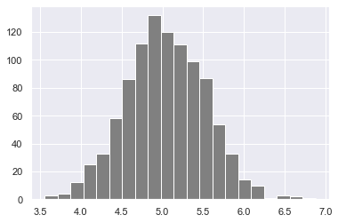
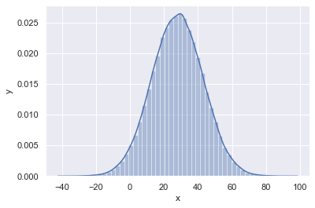

# Día 21 - Python para Análisis Estadístico

## Estadística

La estadística es la disciplina que estudia la *recopilación*, *organización*, *visualización*, *análisis*, *interpretación* y *presentación* de datos.
La estadística es una rama de las matemáticas que se recomienda como prerrequisito para la ciencia de datos y el aprendizaje automático. Si bien la estadística es un campo muy amplio, en esta sección nos centraremos solo en la parte más relevante.
Tras completar este reto, puedes optar por el desarrollo web, el análisis de datos, el aprendizaje automático y la ciencia de datos. Sea cual sea tu trayectoria, en algún momento de tu carrera obtendrás datos con los que podrás trabajar. Tener conocimientos de estadística te ayudará a tomar decisiones basadas en datos.

## Datos

쯈ué son los datos? Los datos son cualquier conjunto de caracteres que se recopila y traduce con algún propósito, generalmente el análisis. Pueden ser cualquier carácter, incluyendo texto, números, imágenes, sonido o vídeo. Si los datos no se contextualizan, no tienen sentido para un ser humano ni para una computadora. Para comprenderlos, necesitamos trabajar con ellos utilizando diferentes herramientas.

El flujo de trabajo del análisis de datos, la ciencia de datos o el aprendizaje automático parte de los datos. Estos pueden provenir de una fuente o pueden crearse. Existen datos estructurados y no estructurados.

Los datos pueden encontrarse en formato pequeño o grande. La mayoría de los tipos de datos que utilizaremos ya se han abordado en la sección sobre gestión de archivos.
## Módulo de Estadística

El módulo *statistics* de Python proporciona funciones para calcular estadísticas matemáticas de datos numéricos. El módulo no pretende competir con bibliotecas de terceros como NumPy, SciPy ni con paquetes estadísticos propietarios y completos, dirigidos a estadísticos profesionales, como Minitab, SAS y Matlab. Está orientado al nivel de calculadoras gráficas y científicas.

# NumPy

En la primera sección, definimos Python como un excelente lenguaje de programación de propósito general por sí solo, pero con la ayuda de otras bibliotecas populares como NumPy, Scipy, Matplotlib, Pandas, etc., se convierte en un potente entorno para la computación científica.

NumPy es la biblioteca principal para la computación científica en Python. Proporciona un objeto de matriz multidimensional de alto rendimiento y herramientas para trabajar con matrices.

Hasta ahora, hemos usado vscode, pero de ahora en adelante recomendaría usar Jupyter Notebook. Para acceder a Jupyter Notebook, instalemos [anaconda](https://www.anaconda.com/). Si usa Anaconda, la mayoría de los paquetes comunes están incluidos y no necesita instalarlos si ya los instaló.

```bash
xnoxos@ubuntu:~/Desktop/ClassofPython$ pip install numpy
```

## Importación de NumPy

Jupyter Notebook está disponible si prefieres [Jupyter Notebook](https://github.com/Asabeneh/data-science-for-everyone/blob/master/numpy/numpy.ipynb)

```python
    # How to import numpy    
    import numpy as np
    # How to check the version of the numpy package    
    print('numpy:', np.__version__)
    
    # Checking the available methods    
    print(dir(np))
```

## Creando una matriz numpy usando

### Creando matrices numpy de tipo int

```python
# Creating Python List
python_list = [1, 2, 3, 4, 5]

# Checking data types
print('Type:', type(python_list))  # <class 'list'>
# print(python_list)  # [1, 2, 3, 4, 5]

# Creating a two-dimensional list
two_dimensional_list = [[0, 1, 2], [3, 4, 5], [6, 7, 8]]
print(two_dimensional_list)  # [[0, 1, 2], [3, 4, 5], [6, 7, 8]]

# Creating Numpy (Numerical Python) array from Python list
import numpy as np  # Make sure to import numpy before using np

numpy_array_from_list = np.array(python_list)
print(type(numpy_array_from_list))  # <class 'numpy.ndarray'>
print(numpy_array_from_list)  # array([1, 2, 3, 4, 5])

```

Creación de matrices numpy de tipo float

Creación de una matriz numpy de tipo float a partir de una lista con un parámetro de tipo float
```python
# Python list
python_list = [1, 2, 3, 4, 5]

# Creating a numpy array from the Python list with float type
import numpy as np  # Ensure numpy is imported

numpy_array_from_list2 = np.array(python_list, dtype=float)
print(numpy_array_from_list2)  # array([1., 2., 3., 4., 5.])
```

### Creación de matrices booleanas numpy

Creación de una matriz booleana numpy a partir de una lista

```python
    numpy_bool_array = np.array([0, 1, -1, 0, 0], dtype=bool)
    print(numpy_bool_array) # array([False,  True,  True, False, False])
```

### Creación de un array multidimensional con Numpy

Un array de Numpy puede tener una o varias filas y columnas.

```python
# Two-dimensional list
two_dimensional_list = [[0, 1, 2], [3, 4, 5], [6, 7, 8]]

# Creating a numpy array from the two-dimensional list
import numpy as np  # Ensure numpy is imported

numpy_two_dimensional_list = np.array(two_dimensional_list)

print(type(numpy_two_dimensional_list))  # <class 'numpy.ndarray'>
print(numpy_two_dimensional_list)  # 
# Output: 
# [[0 1 2]
#  [3 4 5]
#  [6 7 8]]
```
### Convertir una matriz numpy en una lista

```python
# We can always convert an array back to a Python list using tolist()
import numpy as np  # Ensure numpy is imported

numpy_array_from_list = np.array([1, 2, 3, 4, 5])  # Example array
np_to_list = numpy_array_from_list.tolist()

print(type(np_to_list))  # <class 'list'>
print('One dimensional array:', np_to_list)  # [1, 2, 3, 4, 5]

# Converting the two-dimensional numpy array to a Python list
two_dimensional_list = [[0, 1, 2], [3, 4, 5], [6, 7, 8]]
numpy_two_dimensional_list = np.array(two_dimensional_list)

print('Two dimensional array:', numpy_two_dimensional_list.tolist())  
# Output: [[0, 1, 2], [3, 4, 5], [6, 7, 8]]
```

### Creando una matriz numpy a partir de una tupla

```python
# Numpy array from tuple

import numpy as np  # Ensure numpy is imported

# Creating tuple in Python
python_tuple = (1, 2, 3, 4, 5)

# Printing the type and the tuple
print(type(python_tuple))  # <class 'tuple'>
print('python_tuple:', python_tuple)  # python_tuple: (1, 2, 3, 4, 5)

# Creating numpy array from tuple
numpy_array_from_tuple = np.array(python_tuple)

# Printing the type and the numpy array
print(type(numpy_array_from_tuple))  # <class 'numpy.ndarray'>
print('numpy_array_from_tuple:', numpy_array_from_tuple)  # numpy_array_from_tuple: [1 2 3 4 5]
```

### Forma del array numpy

El método de forma proporciona la forma del array como una tupla. La primera es la fila y la segunda, la columna. Si el array es unidimensional, devuelve su tamaño.

```python
import numpy as np  # Ensure numpy is imported

# One-dimensional numpy array
nums = np.array([1, 2, 3, 4, 5])
print(nums)  # [1 2 3 4 5]
print('Shape of nums:', nums.shape)  # (5,)

# Two-dimensional numpy array
two_dimensional_list = [[0, 1, 2], [3, 4, 5], [6, 7, 8]]
numpy_two_dimensional_list = np.array(two_dimensional_list)
print(numpy_two_dimensional_list)  
# [[0 1 2]
#  [3 4 5]
#  [6 7 8]]
print('Shape of numpy_two_dimensional_list:', numpy_two_dimensional_list.shape)  # (3, 3)

# Three by four numpy array
three_by_four_array = np.array([[0, 1, 2, 3],
                                [4, 5, 6, 7],
                                [8, 9, 10, 11]])
print(three_by_four_array.shape)  # (3, 4)
```

Tipos de datos de la matriz numpy

Tipos de datos: str, int, float, complex, bool, list, none

```python
int_lists = [-3, -2, -1, 0, 1, 2,3]
int_array = np.array(int_lists)
float_array = np.array(int_lists, dtype=float)
print(int_array)
print(int_array.dtype)
print(float_array)
print(float_array.dtype)
```
### Tamaño de un array numpy

En numpy, para saber el número de elementos en una lista de arrays numpy, usamos el tamaño.

```python
import numpy as np  # Ensure numpy is imported

# One-dimensional numpy array
numpy_array_from_list = np.array([1, 2, 3, 4, 5])

# Two-dimensional numpy array
two_dimensional_list = np.array([[0, 1, 2],
                                  [3, 4, 5],
                                  [6, 7, 8]])

# Print the size of each array
print('The size of numpy_array_from_list:', numpy_array_from_list.size)  # 5
print('The size of two_dimensional_list:', two_dimensional_list.size)  # 9
```

## Operaciones matemáticas con NumPy

Un array de NumPy no es exactamente igual que una lista de Python. Para realizar operaciones matemáticas en una lista de Python, debemos recorrer los elementos, pero NumPy permite realizar cualquier operación matemática sin bucles.

Operaciones matemáticas:

- Suma (+)
- Resta (-)
- Multiplicación (*)
- División (/)
- Módulos (%)
- División horizontal (//)
- Exponencial (**)

### Suma

```python
import numpy as np  # Ensure numpy is imported

# One-dimensional numpy array
numpy_array_from_list = np.array([1, 2, 3, 4, 5])

# Print the original array
print('Original array:', numpy_array_from_list)

# Adding 10 to each element of the array
ten_plus_original = numpy_array_from_list + 10

# Print the result
print('Array after adding 10:', ten_plus_original)
```
### Subtraction

```python
import numpy as np  # Ensure numpy is imported

# One-dimensional numpy array
numpy_array_from_list = np.array([1, 2, 3, 4, 5])

# Print the original array
print('Original array:', numpy_array_from_list)

# Subtracting 10 from each element of the array
ten_minus_original = numpy_array_from_list - 10

# Print the result
print('Array after subtracting 10:', ten_minus_original)
```
### Multiplication

```python
import numpy as np  # Ensure numpy is imported

# One-dimensional numpy array
numpy_array_from_list = np.array([1, 2, 3, 4, 5])

# Print the original array
print('Original array:', numpy_array_from_list)

# Multiplying each element of the array by 10
ten_times_original = numpy_array_from_list * 10

# Print the result
print('Array after multiplying by 10:', ten_times_original)
```
### Division

```python
import numpy as np  # Ensure numpy is imported

# One-dimensional numpy array
numpy_array_from_list = np.array([1, 2, 3, 4, 5])

# Print the original array
print('Original array:', numpy_array_from_list)

# Dividing each element of the array by 10
ten_times_original = numpy_array_from_list / 10

# Print the result
print('Array after dividing by 10:', ten_times_original)
```
### Modulus

```python
import numpy as np  # Ensure numpy is imported

# One-dimensional numpy array
numpy_array_from_list = np.array([1, 2, 3, 4, 5])

# Print the original array
print('Original array:', numpy_array_from_list)

# Finding the remainder when each element is divided by 3
ten_times_original = numpy_array_from_list % 3

# Print the result
print('Array after applying modulus 3:', ten_times_original)
```
### Floor Division

```python
import numpy as np  # Ensure numpy is imported

# One-dimensional numpy array
numpy_array_from_list = np.array([1, 2, 3, 4, 5])

# Print the original array
print('Original array:', numpy_array_from_list)

# Floor division: dividing each element by 10 and discarding the remainder
ten_times_original = numpy_array_from_list // 10

# Print the result
print('Array after floor division by 10:', ten_times_original)
```
### Exponential

```python
import numpy as np  # Ensure numpy is imported

# One-dimensional numpy array
numpy_array_from_list = np.array([1, 2, 3, 4, 5])

# Print the original array
print('Original array:', numpy_array_from_list)

# Exponential: raising each element to the power of 2
ten_times_original = numpy_array_from_list ** 2

# Print the result
print('Array after squaring each element:', ten_times_original)
```
## Checking data types

```python
import numpy as np  # Ensure numpy is imported

# Creating numpy arrays of different types
numpy_int_arr = np.array([1, 2, 3, 4])
numpy_float_arr = np.array([1.1, 2.0, 3.2])
numpy_bool_arr = np.array([-3, -2, 0, 1, 2, 3], dtype='bool')

# Printing the data types of the arrays
print(numpy_int_arr.dtype)  # int64 (or int32 depending on your system)
print(numpy_float_arr.dtype)  # float64
print(numpy_bool_arr.dtype)  # bool
```
### Converting types

We can convert the data types of numpy array

1. Int to Float

```python
import numpy as np  # Ensure numpy is imported

# Creating a numpy array of integers with dtype 'float'
numpy_int_arr = np.array([1, 2, 3, 4], dtype='float')

# Display the array
print(numpy_int_arr)
```

1. Float to Int

```python
import numpy as np  # Ensure numpy is imported

# Creating a numpy array of floats and converting it to integers
numpy_int_arr = np.array([1., 2., 3., 4.], dtype='int')

# Display the array
print(numpy_int_arr)
```

1. Int ot boolean

```python
import numpy as np  # Ensure numpy is imported

# Creating a numpy array with integers and converting them to booleans
numpy_bool_arr = np.array([-3, -2, 0, 1, 2, 3], dtype='bool')

# Display the array
print(numpy_bool_arr)
```

1. Int to str

```python
import numpy as np  # Ensure numpy is imported

# Creating a numpy array of floats
numpy_float_list = np.array([1.5, 2.3, 3.7, 4.8])

# Converting the array first to integers, then to strings
numpy_str_list = numpy_float_list.astype('int').astype('str')

# Display the result
print(numpy_str_list)
```
## Multi-dimensional Arrays

```python
import numpy as np  # Ensure numpy is imported

# Creating a 2-dimensional numpy array
two_dimension_array = np.array([(1, 2, 3), (4, 5, 6), (7, 8, 9)])

# Printing the type of the array
print(type(two_dimension_array))  # <class 'numpy.ndarray'>

# Printing the 2-dimensional array
print(two_dimension_array)
# [[1 2 3]
#  [4 5 6]
#  [7 8 9]]

# Printing the shape of the array (number of rows and columns)
print('Shape:', two_dimension_array.shape)  # (3, 3)

# Printing the size of the array (total number of elements)
print('Size:', two_dimension_array.size)  # 9

# Printing the data type of the array elements
print('Data type:', two_dimension_array.dtype)  # int64 (or int32 depending on your system)
```
### Obtener elementos de una matriz numpy

```python
import numpy as np  # Ensure numpy is imported

# Creating a 2-dimensional numpy array
two_dimension_array = np.array([[1, 2, 3], [4, 5, 6], [7, 8, 9]])

# Extracting specific rows from the 2D array
first_row = two_dimension_array[0]
second_row = two_dimension_array[1]
third_row = two_dimension_array[2]

# Printing the extracted rows
print('First row:', first_row)
print('Second row:', second_row)
print('Third row:', third_row
```

```python
import numpy as np  # Ensure numpy is imported

# Creating a 2-dimensional numpy array
two_dimension_array = np.array([[1, 2, 3], [4, 5, 6], [7, 8, 9]])

# Extracting specific columns from the 2D array
first_column = two_dimension_array[:, 0]
second_column = two_dimension_array[:, 1]
third_column = two_dimension_array[:, 2]

# Printing the extracted columns
print('First column:', first_column)
print('Second column:', second_column)
print('Third column:', third_column)

# Printing the entire 2D array
print('Entire 2D array:')
print(two_dimension_array)
```

Segmentación de un array de Numpy

Segmentar en Numpy es similar a segmentar en una lista de Python.

```python
import numpy as np  # Ensure numpy is imported

# Creating a 2-dimensional numpy array
two_dimension_array = np.array([[1, 2, 3], [4, 5, 6], [7, 8, 9]])

# Extracting the first two rows and first two columns
first_two_rows_and_columns = two_dimension_array[0:2, 0:2]

# Printing the extracted subarray
print(first_two_rows_and_columns)
```
### 쮺칩mo invertir las filas y toda la matriz?

```python
two_dimension_array[::]
```
### Invertir las posiciones de filas y columnas

```python
import numpy as np  # Ensure numpy is imported

# Creating a 2-dimensional numpy array
two_dimension_array = np.array([[1, 2, 3], [4, 5, 6], [7, 8, 9]])

# Inverting rows and columns
inverted_array = two_dimension_array[::-1, ::-1]

# Printing the inverted array
print(inverted_array)
```

## 쮺칩mo representar valores faltantes?

```python
import numpy as np  # Ensure numpy is imported

# Creating a 2-dimensional numpy array
two_dimension_array = np.array([[1, 2, 3], [4, 5, 6], [7, 8, 9]])

# Printing the original array
print("Original array:")
print(two_dimension_array)

# Modifying specific elements in the array
two_dimension_array[1, 1] = 55  # Changing the element at position (1, 1)
two_dimension_array[1, 2] = 44  # Changing the element at position (1, 2)

# Printing the modified array
print("\nModified array:")
print(two_dimension_array)
```

```python
import numpy as np  # Ensure numpy is imported

# Creating a 3x3 numpy array of zeros with integer type
numpy_zeroes = np.zeros((3, 3), dtype=int, order='C')

# Displaying the created array
print(numpy_zeroes)
```

```python
import numpy as np  # Ensure numpy is imported

# Creating a 3x3 numpy array of ones with integer type
numpy_ones = np.ones((3, 3), dtype=int, order='C')

# Printing the created array
print(numpy_ones)
```

```python
import numpy as np  # Ensure numpy is imported

# Creating a 3x3 numpy array of ones with integer type
numpy_ones = np.ones((3, 3), dtype=int, order='C')

# Multiplying the array by 2
twoes = numpy_ones * 2

# Printing the result
print(twoes)
```

```python
import numpy as np  # Ensure numpy is imported

# Creating a 2-dimensional numpy array
first_shape = np.array([(1, 2, 3), (4, 5, 6)])

# Printing the original array
print("Original array:")
print(first_shape)

# Reshaping the array to a new shape (3 rows, 2 columns)
reshaped = first_shape.reshape(3, 2)

# Printing the reshaped array
print("\nReshaped array:")
print(reshaped)
```

```python
import numpy as np  # Ensure numpy is imported

# Creating a 2-dimensional numpy array
first_shape = np.array([(1, 2, 3), (4, 5, 6)])

# Reshaping the array to a new shape (3 rows, 2 columns)
reshaped = first_shape.reshape(3, 2)

# Flattening the reshaped array to a 1D array
flattened = reshaped.flatten()

# Printing the flattened array
print(flattened)
```

```python
import numpy as np  # Ensure numpy is imported

# Creating two numpy arrays
np_list_one = np.array([1, 2, 3])
np_list_two = np.array([4, 5, 6])

# Printing the element-wise sum of the two arrays
print("Element-wise sum:", np_list_one + np_list_two)

# Performing horizontal stack (concatenation along the second axis)
print('Horizontal Append (stack):', np.hstack((np_list_one, np_list_two)))
```

```python
import numpy as np  # Ensure numpy is imported

# Creating two numpy arrays
np_list_one = np.array([1, 2, 3])
np_list_two = np.array([4, 5, 6])

# Performing vertical stack (concatenation along the first axis)
print('Vertical Append (stack):', np.vstack((np_list_one, np_list_two)))

```

### Generando números aleatorios

```python
import numpy as np

# Generar un número flotante aleatorio entre 0.0 y 1.0
random_float = np.random.random()
random_float
```

```python
import numpy as np

# Generar un array con 5 números flotantes aleatorios entre 0.0 y 1.0
random_floats = np.random.random(5)
random_floats
```

```python
import numpy as np

# Generar un entero aleatorio entre 0 y 10 (10 incluido)
random_int = np.random.randint(0, 11)
random_int
```

```python
import numpy as np

# Genera 4 enteros aleatorios entre 2 (inclusive) y 10 (exclusivo), es decir, entre 2 y 9.
random_int = np.random.randint(2, 10, size=4)
random_int
```

```python
import numpy as np

# Generating a random integers between 0 and 10
random_int = np.random.randint(2, 10, size=(3, 3))
random_int
```

### Generando números aleatorios

```python
import numpy as np

# np.random.normal(mu, sigma, size)
normal_array = np.random.normal(79, 15, 80)
normal_array
```
## Numpy and Statistics

```python
import matplotlib.pyplot as plt
import seaborn as sns

# Configura el estilo de las gráficas con seaborn
sns.set()

# Crea un histograma del array 'normal_array'
# Se utiliza color gris y se definen 50 bins para la distribución
plt.hist(normal_array, color="grey", bins=50)
plt.show()  # Muestra la gráfica
```
### Matrix in numpy

```python
import numpy as np

# Crea un array de 4x4 lleno de unos de tipo float y lo convierte en una matriz de NumPy
four_by_four_matrix = np.matrix(np.ones((4,4), dtype=float))
```

```python
import numpy as np

# Creamos una matriz 4x4 de unos (tipo float)
four_by_four_matrix = np.matrix(np.ones((4, 4), dtype=float))

# Multiplicamos la tercera fila (índice 2) por 2 y la asignamos nuevamente
four_by_four_matrix[2, :] = 2 * four_by_four_matrix[2, :]

four_by_four_matrix
```

### Numpy numpy.arange()

### 쯈ué es Arrange?

A veces, se necesita crear valores con una distribución uniforme dentro de un intervalo definido. Por ejemplo, si se quieren crear valores del 1 al 10, se puede usar la función numpy.arange().

```python
lst = range(0, 11, 2)
print(list(lst))
```

```python
range(0, 11, 2)
```

```python
for l in lst:
    print(l)
```

```python
import numpy as np

# Similar a range, np.arange(start, stop, step) genera un array de números
whole_numbers = np.arange(0, 20, 1)
whole_numbers
```

```python
import numpy as np

# Genera un array de números naturales desde 1 hasta 19
natural_numbers = np.arange(1, 20, 1)
natural_numbers
```

```python
odd_numbers = np.arange(1, 20, 2)
odd_numbers
```

```python
even_numbers = np.arange(2, 20, 2)
even_numbers
```

### Creando una secuencia de números usando linspace

```python
import numpy as np

# Genera 10 valores equidistantes entre 1.0 y 5.0
values = np.linspace(1.0, 5.0, num=10)
values
```

```python
import numpy as np

# Genera 5 valores equidistantes desde 1.0 hasta justo antes de 5.0
values = np.linspace(1.0, 5.0, num=5, endpoint=False)
values
```

```python
import numpy as np

# Genera 4 valores en una escala logarítmica entre 10^2 y 10^4
log_values = np.logspace(2, 4.0, num=4)
log_values
```

```python
import numpy as np

# Crear un array de 3 elementos con tipo de dato complejo
x = np.array([1, 2, 3], dtype=np.complex128)

# Verificar el tamaño del array
print(x.size)  # Salida: 3
```

```python
import numpy as np

np_list = np.array([(1, 2, 3), (4, 5, 6)])
np_list
```

```python
First row:  [1 2 3]
Second row:  [4 5 6]
```

```pascal
print('First column: ', np_list[:,0])
print('Second column: ', np_list[:,1])
print('Third column: ', np_list[:,2])
```

Funciones estadísticas de NumPy con ejemplo

NumPy cuenta con funciones estadísticas muy útiles para calcular el mínimo, el máximo, la media, la mediana, el percentil, la desviación estándar, la varianza, etc., de los elementos dados en el array.
Las funciones se explican a continuación:
Función estadística
NumPy cuenta con las funciones estadísticas robustas que se listan a continuación:

- Funciones de NumPy
- Mín. np.min()
- Máx. np.max()
- Media. np.mean()
- Mediana. np.median()
- Varianza
- Percentil
- Desviación estándar. np.std()

```python
import numpy as np

# Genera 100 valores a partir de una distribución normal con media 5 y desviación estándar 0.5
np_normal_dis = np.random.normal(5, 0.5, 100)

# Calcular y mostrar estadísticas del array
print('min: ', np_normal_dis.min())
print('max: ', np_normal_dis.max())
print('mean: ', np_normal_dis.mean())
print('median: ', np.median(np_normal_dis))
print('sd: ', np_normal_dis.std())
```

```python
import numpy as np

# Suponiendo que two_dimension_array es, por ejemplo:
two_dimension_array = np.array([[3, 5, 1],
                                [7, 2, 8],
                                [4, 9, 6]])

print(two_dimension_array)
print('Column with minimum: ', np.amin(two_dimension_array, axis=0))
print('Column with maximum: ', np.amax(two_dimension_array, axis=0))
print('=== Row ===')
print('Row with minimum: ', np.amin(two_dimension_array, axis=1))
print('Row with maximum: ', np.amax(two_dimension_array, axis=1))
```

### 쮺칩mo crear secuencias repetidas?

```python
import numpy as np

a = [1, 2, 3]

# Repite la lista completa dos veces
print('Tile:   ', np.tile(a, 2))
# Salida: [1 2 3 1 2 3]

# Repite cada elemento de la lista dos veces
print('Repeat: ', np.repeat(a, 2))
# Salida: [1 1 2 2 3 3]
```

### 쮺칩mo generar números aleatorios?

```python
import numpy as np

# Genera un número aleatorio entre [0, 1)
one_random_num = np.random.random()

# Se asigna el módulo np.random a la variable one_random_in, pero no se usa en este ejemplo
one_random_in = np.random

# Imprime el número aleatorio generado
print(one_random_num)
```

```python
import numpy as np

# Genera un array 2x3 con números aleatorios entre 0 (inclusive) y 1 (exclusivo)
r = np.random.random(size=[2,3])
print(r)
```

```python
import numpy as np

# Selecciona aleatoriamente 10 letras de la lista
print(np.random.choice(['a', 'e', 'i', 'o', 'u'], size=10))
```

```python
import numpy as np

# Genera un array de 2x2 con números aleatorios entre 0 y 1 (excluyendo 1)
rand = np.random.rand(2,2)
rand
```

```python
rand2 = np.random.randn(2,2)
rand2
```

```python
import numpy as np

# Genera números enteros aleatorios entre 0 (inclusive) y 10 (exclusivo) de forma 2x5
rand_int = np.random.randint(0, 10, size=[2,5])
rand_int
```

```python
from scipy import stats
import numpy as np

# Genera 1000 muestras de una distribución normal con media=5 y desviación estándar=0.5
np_normal_dis = np.random.normal(5, 0.5, 1000)

# Calcula y muestra las estadísticas básicas
print('min: ', np.min(np_normal_dis))
print('max: ', np.max(np_normal_dis))
print('mean: ', np.mean(np_normal_dis))
print('median: ', np.median(np_normal_dis))
print('mode: ', stats.mode(np_normal_dis))
print('sd: ', np.std(np_normal_dis))
```


```python
import matplotlib.pyplot as plt

plt.hist(np_normal_dis, color="grey", bins=21)
plt.show()
```



```python
import numpy as np

# Ejemplo: Producto punto usando numpy.dot
a = np.array([1, 2])
b = np.array([3, 4])
resultado = np.dot(a, b)

print("Producto punto:", resultado)
```

### Linear Algebra

1. Dot Product

```python
import numpy as np

# Linear algebra: Dot product of two arrays
f = np.array([1, 2, 3])
g = np.array([4, 5, 3])
result = np.dot(f, g)  # 1*4 + 2*5 + 3*3 = 23

print(result)
```

### Multiplicación de matrices de NumPy con np.matmul()

```python
import numpy as np
# Matmul: producto matricial de dos arreglos
h = np.array([[1,2],[3,4]])
i = np.array([[5,6],[7,8]])
resultado = np.matmul(h, i)  # Se espera: [[19,22],[43,50]]
print(resultado)
```

```python
import numpy as np

# Matmul: Matrix product of two arrays
h = np.array([[1, 2], [3, 4]])
i = np.array([[5, 6], [7, 8]])
matmul_result = np.matmul(h, i)  # 1*5+2*7 = 19 for the first element

print("Matrix product (h * i):")
print(matmul_result)

# Determinant of 2x2 matrix i
determinant = np.linalg.det(i)  # 5*8 - 7*6 = -2

print("Determinant of matrix i:", determinant)
```

```python
new_list = [x + 2 for x in range(0, 11)]
print(new_list)

```

```python
import numpy as np

np_arr = np.array(range(0, 11))
result = np_arr + 2  # Add 2 to each element

print(result)
```

Utilizamos ecuaciones lineales para cantidades que tienen una relación lineal. Veamos el siguiente ejemplo:

```python
import numpy as np

temp = np.array([1, 2, 3, 4, 5])
pressure = temp * 2 + 5

print(pressure)
```

```python
import numpy as np
import matplotlib.pyplot as plt

temp = np.array([1, 2, 3, 4, 5])
pressure = temp * 2 + 5

plt.plot(temp, pressure)
plt.xlabel('Temperature in oC')
plt.ylabel('Pressure in atm')
plt.title('Temperature vs Pressure')
plt.xticks(np.arange(0, 6, step=0.5))
plt.show()
```


Para dibujar la distribución normal gaussiana con Numpy, como se puede ver a continuación, Numpy puede generar números aleatorios. Para crear una muestra aleatoria, necesitamos la media (mu), la sigma (desviación estándar) y el número de puntos de datos.


```python
import numpy as np
import seaborn as sns
import matplotlib.pyplot as plt

mu = 28
sigma = 15
samples = 100000

x = np.random.normal(mu, sigma, samples)
ax = sns.histplot(x, kde=True)
ax.set(xlabel="x", ylabel='y')
plt.show()

```



# Resumen

En resumen, las principales diferencias con las listas de Python son:

1. Los arrays admiten operaciones vectorizadas, mientras que las listas no.
2. Una vez creado un array, no se puede cambiar su tamaño. Se deberá crear uno nuevo o sobrescribir el existente.
3. Cada array tiene un único tipo de datos. Todos sus elementos deben ser de ese tipo de datos.
4. Un array numpy equivalente ocupa mucho menos espacio que una lista de listas de Python.
5. Los arrays numpy admiten indexación booleana.

## 💻 Ejercicios: Día 21

1. Repetir todos los ejemplos.

🎉 ¡FELICIDADES! 🎉