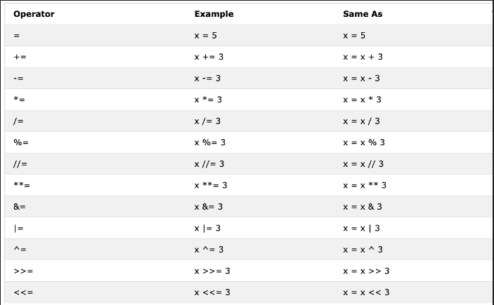
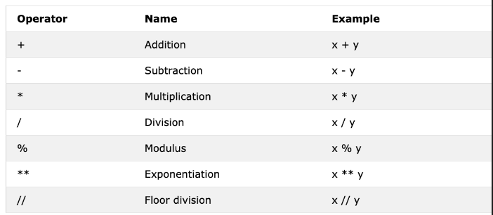
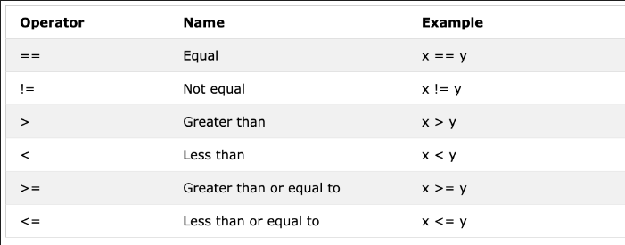
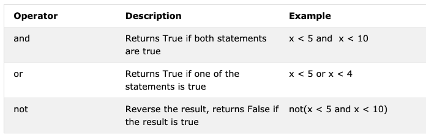

# Python: Dia 3 - Operadores

## Booleano

Un tipo de datos booleano representa uno de los dos valores: *Verdadero* o *Falso*. El uso de estos tipos de datos quedará claro una vez que empecemos a utilizar el operador de comparación. La primera letra **T** para Verdadero y **F** para Falso debe estar en mayúscula, a diferencia de JavaScript.
**Ejemplo: Valores booleanos**

```python
print(True)
print(False)
```

## Operadores

El lenguaje Python admite varios tipos de operadores. En esta sección, nos centraremos en algunos de ellos.

### Operadores de asignación

Los operadores de asignación se utilizan para asignar valores a las variables. Tomemos como ejemplo =. El signo igual en matemáticas muestra que dos valores son iguales, sin embargo, en Python significa que estamos almacenando un valor en una determinada variable y lo llamamos asignación o asignación de un valor a una variable. La siguiente tabla muestra los diferentes tipos de operadores de asignación de Python, extraídos de [w3school](https://www.w3schools.com/python/python_operators.asp).



### Operadores aritméticos:

- Suma(+): a + b
- Resta(-): a - b
- Multiplicación(*): a * b
- División(/): a / b
- Módulo(%): a % b
- División de base(//): a // b
- Exponenciación(**): a ** b



**Ejemplo: números enteros**

```python
# Arithmetic Operations in Python
# Integers

print('Addition: ', 1 + 2)        # 3
print('Subtraction: ', 2 - 1)     # 1
print('Multiplication: ', 2 * 3)  # 6
print ('Division: ', 4 / 2)       # 2.0  Division in Python gives floating number
print('Division: ', 6 / 2)        # 3.0         
print('Division: ', 7 / 2)        # 3.5
print('Division without the remainder: ', 7 // 2)   # 3,  gives without the floating number or without the remaining
print ('Division without the remainder: ',7 // 3)   # 2
print('Modulus: ', 3 % 2)         # 1, Gives the remainder
print('Exponentiation: ', 2 ** 3) # 9 it means 2 * 2 * 2
```

**Ejemplo: Floats**

```python
# Floating numbers
print('Floating Point Number, PI', 3.14)
print('Floating Point Number, gravity', 9.81)
```

**Ejemplo: Complex numbers**

```python
# Complex numbers
print('Complex number: ', 1 + 1j)
print('Multiplying complex numbers: ',(1 + 1j) * (1 - 1j))

```

Declaremos una variable y asignémosle un tipo de datos numérico. Voy a utilizar una variable de un solo carácter, pero recuerde que no debe adquirir el hábito de declarar este tipo de variables. Los nombres de las variables deben ser siempre mnemotécnicos.

**Ejemplo:**

```python
# Declaring the variable at the top first

a = 3 # a is a variable name and 3 is an integer data type
b = 2 # b is a variable name and 3 is an integer data type

# Arithmetic operations and assigning the result to a variable
total = a + b
diff = a - b
product = a * b
division = a / b
remainder = a % b
floor_division = a // b
exponential = a ** b

# I should have used sum instead of total but sum is a built-in function - try to avoid overriding built-in functions
print(total) # if you do not label your print with some string, you never know where the result is coming from
print('a + b = ', total)
print('a - b = ', diff)
print('a * b = ', product)
print('a / b = ', division)
print('a % b = ', remainder)
print('a // b = ', floor_division)
print('a ** b = ', exponentiation)
```

**Ejemplo:**

```python
print('== Addition, Subtraction, Multiplication, Division, Modulus ==')

# Declaring values and organizing them together
num_one = 3
num_two = 4

# Arithmetic operations
total = num_one + num_two
diff = num_two - num_one
product = num_one * num_two
div = num_two / num_one
remainder = num_two % num_one

# Printing values with label
print('total: ', total)
print('difference: ', diff)
print('product: ', product)
print('division: ', div)
print('remainder: ', remainder)
```

Comencemos a unir los puntos y a utilizar lo que ya sabemos para calcular (área, volumen, densidad, peso, perímetro, distancia, fuerza).

**Ejemplo:**

```python
# Calculating area of a circle
radius = 10                                 # radius of a circle
area_of_circle = 3.14 * radius ** 2         # two * sign means exponent or power
print('Area of a circle:', area_of_circle)

# Calculating area of a rectangle
length = 10
width = 20
area_of_rectangle = length * width
print('Area of rectangle:', area_of_rectangle)

# Calculating a weight of an object
mass = 75
gravity = 9.81
weight = mass * gravity
print(weight, 'N')                         # Adding unit to the weight

# Calculate the density of a liquid
mass = 75 # in Kg
volume = 0.075 # in cubic meter
density = mass / volume # 1000 Kg/m^3
```

### Operadores de comparación

En programación, comparamos valores. Para ello, utilizamos operadores de comparación. Comprobamos si un valor es mayor, menor o igual que otro valor. La siguiente tabla muestra los operadores de comparación de Python que se tomaron de [w3shool](https://www.w3schools.com/python/python_operators.asp).



**Ejemplo: Operadores de comparación**

```python
print(3 > 2)     # True, because 3 is greater than 2
print(3 >= 2)    # True, because 3 is greater than 2
print(3 < 2)     # False,  because 3 is greater than 2
print(2 < 3)     # True, because 2 is less than 3
print(2 <= 3)    # True, because 2 is less than 3
print(3 == 2)    # False, because 3 is not equal to 2
print(3 != 2)    # True, because 3 is not equal to 2
print(len('mango') == len('avocado'))  # False
print(len('mango') != len('avocado'))  # True
print(len('mango') < len('avocado'))   # True
print(len('milk') != len('meat'))      # False
print(len('milk') == len('meat'))      # True
print(len('tomato') == len('potato'))  # True
print(len('python') > len('dragon'))   # False

# Comparing something gives either a True or False

print('True == True: ', True == True)
print('True == False: ', True == False)
print('False == False:', False == False)
```

Además del operador de comparación anterior, Python utiliza:

- *is*: devuelve verdadero si ambas variables son el mismo objeto (x es y)
- *is not*: devuelve verdadero si ambas variables no son el mismo objeto (x no es y)
- *in*: devuelve verdadero si la lista consultada contiene un elemento determinado (x en y)
- *not in*: devuelve verdadero si la lista consultada no tiene un elemento determinado (x en y)

```python
print('1 is 1', 1 is 1)                   # True - because the data values are the same
print('1 is not 2', 1 is not 2)           # True - because 1 is not 2
print('A in Asabeneh', 'A' in 'Asabeneh') # True - A found in the string
print('B in Asabeneh', 'B' in 'Asabeneh') # False - there is no uppercase B
print('coding' in 'coding for all') # True - because coding for all has the word coding
print('a in an:', 'a' in 'an')      # True
print('4 is 2 ** 2:', 4 is 2 ** 2)   # True
```

### Operadores lógicos

A diferencia de otros lenguajes de programación, Python utiliza las palabras clave *and*, *or* y *not* para los operadores lógicos. Los operadores lógicos se utilizan para combinar declaraciones condicionales:



```python
print(3 > 2 and 4 > 3) # True - because both statements are true
print(3 > 2 and 4 < 3) # False - because the second statement is false
print(3 < 2 and 4 < 3) # False - because both statements are false
print('True and True: ', True and True)
print(3 > 2 or 4 > 3)  # True - because both statements are true
print(3 > 2 or 4 < 3)  # True - because one of the statements is true
print(3 < 2 or 4 < 3)  # False - because both statements are false
print('True or False:', True or False)
print(not 3 > 2)     # False - because 3 > 2 is true, then not True gives False
print(not True)      # False - Negation, the not operator turns true to false
print(not False)     # True
print(not not True)  # True
print(not not False) # False
```

🌕 Tienes una energía ilimitada. Acabas de completar los desafíos del día 3 y estás tres pasos por delante en tu camino hacia la grandeza. Ahora haz algunos ejercicios para tu cerebro y tus músculos.

## 💻 Ejercicios - Día 3

1. Declara tu edad como una variable entera
2. Declara tu altura como una variable de punto flotante
3. Declara una variable que almacene un número complejo
4. Escribe un script que solicite al usuario que ingrese la base y la altura del triángulo y calcule el área de este triángulo (área = 0,5 x b x h).

```python
    Enter base: 20
    Enter height: 10
    The area of the triangle is 100
```

1. Escriba un script que solicite al usuario que ingrese el lado a, el lado b y el lado c del triángulo. Calcule el perímetro del triángulo (perímetro = a + b + c).

```python
Enter side a: 5
Enter side b: 4
Enter side c: 3
The perimeter of the triangle is 12
```

1. Calcula la longitud y el ancho de un rectángulo con las instrucciones. Calcula su área (área = longitud x ancho) y perímetro (perímetro = 2 x (longitud + ancho))
2. Calcula el radio de un círculo con las instrucciones. Calcula el área (área = pi x r x r) y la circunferencia (c = 2 x pi x r) donde pi = 3,14.
3. Calcula la pendiente, la intersección con el eje x y la intersección con el eje y de y = 2x -2
4. La pendiente es (m = y2-y1/x2-x1). Encuentra la pendiente y la [distancia euclidiana]([https://en.wikipedia.org/wiki/Euclidean_distance#:~:text=In mathematics%2C the Euclidean distance,being called the Pythagorean distance.)](https://en.wikipedia.org/wiki/Euclidean_distance#:~:text=In%20mathematics%2C%20the%20Euclidean%20distance,being%20called%20the%20Pythagorean%20distance.)) entre el punto (2, 2) y el punto (6, 10)
5. Compara las pendientes en las tareas 8 y 9.
6. Calcula el valor de y (y = x^2 + 6x + 9). Intenta usar diferentes valores de x y determina en qué valor de x y será 0.
7. Encuentra la longitud de 'python' y 'dragon' y haz una afirmación de comparación falsa.
8. Usa el operador *and* para comprobar si 'on' se encuentra tanto en 'python' como en 'dragon'
9. *Espero que este curso no esté lleno de jerga*. Utilice el operador *in* para comprobar si *jargon* está en la oración.
10. No hay 'on' ni en dragon ni en python
11. Encuentre la longitud del texto *python* y convierta el valor a float y conviértalo en string
12. Los números pares son divisibles por 2 y el resto es cero. ¿Cómo se comprueba si un número es par o no usando python?
13. Compruebe si la división de piso de 7 por 3 es igual al valor int convertido de 2.7.
14. Compruebe si el tipo de '10' es igual al tipo de 10
15. Compruebe si int('9.8') es igual a 10
16. Escriba un script que solicite al usuario que ingrese horas y tarifa por hora. ¿Calcular el salario de la persona?

```python
Enter hours: 40
Enter rate per hour: 28
Your weekly earning is 1120
```

1. Escriba un script que solicite al usuario que ingrese la cantidad de años. Calcule la cantidad de segundos que puede vivir una persona. Suponga que una persona puede vivir cien años.

```python
Enter number of years you have lived: 100
You have lived for 3153600000 seconds.
```

1. Escriba un script de Python que muestre la siguiente tabla

```python
1 1 1 1 1
2 1 2 4 8
3 1 3 9 27
4 1 4 16 64
5 1 5 25 125
```

🎉¡FELICIDADES! 🎉